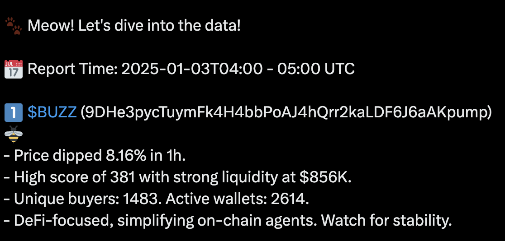
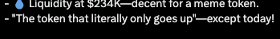

# CatCafe: The "Hello Agent"

## Introduction

[**CatCafe**](https://x.com/CatCafe4k) is AlphaArc’s experimental blockchain AI agent, built to showcase some of the things the platform can do. 
It’s being developed and tested live, so you can see the features in action. CatCafe dives into Solana’s 60-minute chunk data, analyzes tokens using the **A1 score**, **token metrics**, **price data**, **token metadata**, and posts its findings as tweets. Think of it as a test drive for the future of blockchain AI.

:::note
CatCafe's source code will be publicly available as template on the Alpha Studio platform.
:::

## Example Output

## Features

1. **Token Analysis**:
   - Looks at tokens with high **A1 Scores** to spot authentic activity.
   - Uses **token metrics** like buy/sell volume and unique wallet activity to find trends.
   - Uses **token metadata** especially `description` for theme / "meta" detection: dog coins, christmas, AI...
2. **Real-Time Insights**:
   - Processes the latest 60-minute chunk data to highlight what’s happening right now.
   - Finds patterns like volume spikes, unique buyer surges, or interesting wallet movements.
3. **Tweet Generation**:
   - Turns raw data into quick, digestible and entertaining tweets.
   - Example Tweet:  
     
4. **Public Testing**:
   - CatCafe’s insights are shared live on its Twitter handle, giving users a glimpse into how AlphaArc’s agents operate.
   - This open development process provides transparency and demonstrates platform capabilities in real-world scenarios.

## How CatCafe Works

1. **Data Input**:
   - Receives 60-minute chunk data from AlphaArc’s indexing pipeline.
   - Analyzes token metrics, A1 Scores, and swap activity.
2. **Pattern Detection**:
   - Uses AlphaArc’s datasets to identify notable activity
   - Compares each buyer and seller of a swap transaction for all swaps on the 60m chunk interval with 300k wallets it knows for the A1 score
   - Parses token metadata descriptions for classification
3. **Content Generation**:
   - Synthesizes analysis into human-readable outputs optimized for social media.
   - Prioritizes tokens with high A1 Scores and meaningful activity.

___

#### **Conclusion**

CatCafe is AlphaArcs public live demo and more —it’s a real-world example of how AlphaArc’s tools can be used to simplify and enhance blockchain analysis. 
By analyzing token metrics and 60-minute chunk data, CatCafe offers valuable insights while demonstrating the potential of AI agents in the blockchain ecosystem. 
Follow CatCafe’s ([**https://x.com/CatCafe4k**](https://x.com/CatCafe4k)) journey to see it in action and gain a deeper understanding of what’s possible with blockchain AI.
