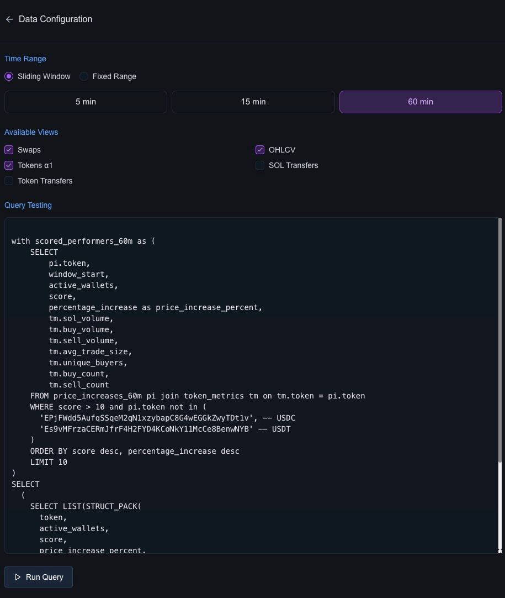
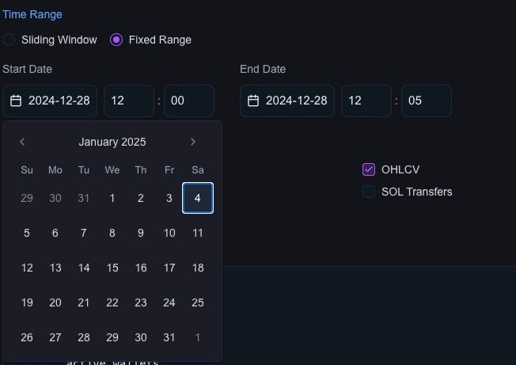
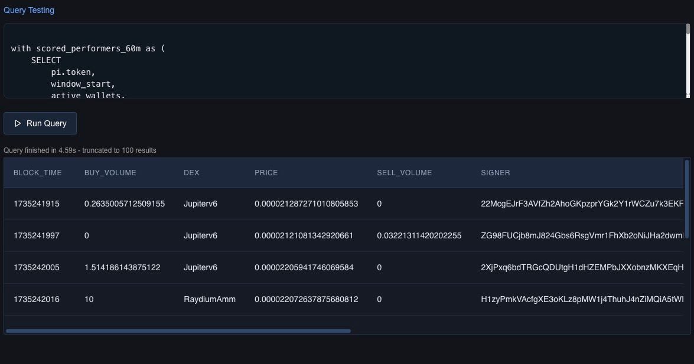

# Data Source Configuration

The **Data Source Configuration** section allows users to define and customize the data inputs for their agents. This includes selecting datasets, running test queries, and configuring time range settings. The flexibility of choosing between fixed time ranges and sliding windows ensures that the data is tailored to specific use cases while also providing triggers for real-time agent execution with chunked data.



---

#### **Features**

1. **Dataset Selection**:
   - Users can choose from available [datasets](../03-data/category/datasets), such as:
     - **Swaps**
     - **Tokens A1**
     - **Token Transfers**
     - **OHLCV**
     - **SOL Transfers**
     - **... and more**
   - Multiple datasets can be selected simultaneously, giving agents access to diverse data sources.

2. **Time Range Settings**:
   - **Fixed Range**:
     - Specify a static time range for querying historical data.
     
     
   - **Sliding Window**:
     - Continuously processes the most recent data within a moving window (e.g., 5, 15, or 60 minutes).
     - Acts as a trigger to invoke the agent whenever new data is available.

3. **Query Testing**:
   - A built-in query editor allows users to:
     - Write and test SQL-like queries.
     - Validate data selection and transformation logic before deploying the agent.
   - Example Query:
     ```sql
     SELECT *
     FROM swaps
     LIMIT 10;
     ```

4. **Data Preview**:
   - After running test queries, users can preview results directly in the UI to ensure correctness.

---

#### **How It Works**

1. **Selecting a Dataset**:
   - Tick the checkboxes for the datasets you want the agent to access (e.g., OHLCV or Swaps).

2. **Configuring Time Range**:
   - Choose between:
     - **Fixed Range** for analyzing specific time periods.
     - **Sliding Window** for continuous, real-time analysis.
   - Define the interval size (e.g., 5, 15, or 60 minutes).

3. **Running Test Queries**:
   - Write SQL-like queries in the query editor to filter and transform the data.
   - Run the query to validate results and preview the output.

4. **Agent Triggering**:
   - For sliding windows, the agent is invoked automatically whenever new data for the selected interval becomes available.

---

#### **Best Practices**

- **Start Simple**:
   - Begin with a single dataset and gradually add more as needed to ensure the agent logic handles complexity effectively.

- **Optimize Queries**:
   - Write efficient queries to reduce processing time and ensure real-time triggers execute smoothly.

- **Test Before Deploying**:
   - Always validate queries using the test feature to catch issues early.

## Data Preview

The Data Preview feature allows users to quickly view the results of their test queries directly in the UI. This ensures the selected datasets, applied filters, and transformations are correct before deploying the agent. By providing a clear snapshot of the query output, the data preview helps users validate their configurations and fine-tune queries for optimal performance. This step is crucial for catching issues early and ensuring agents work as intended.


