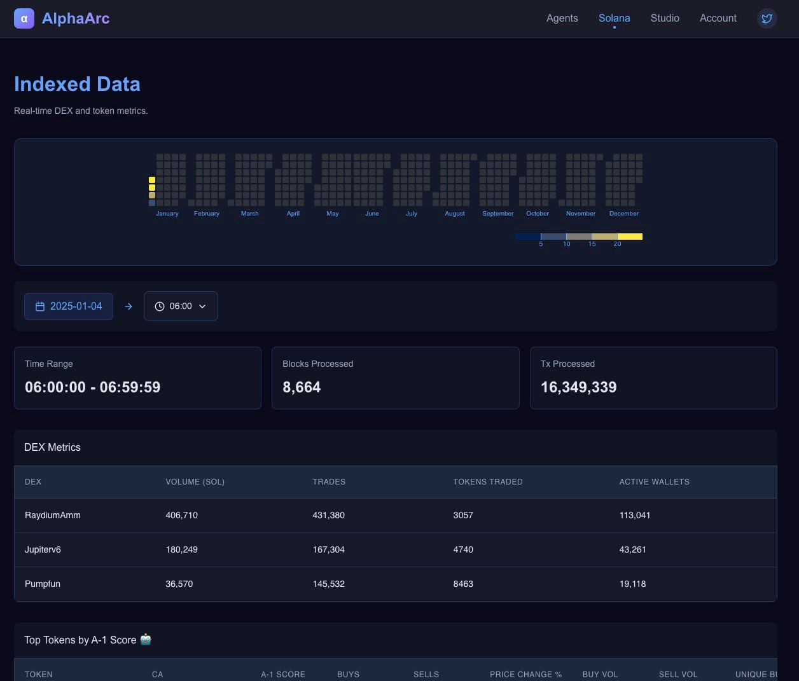
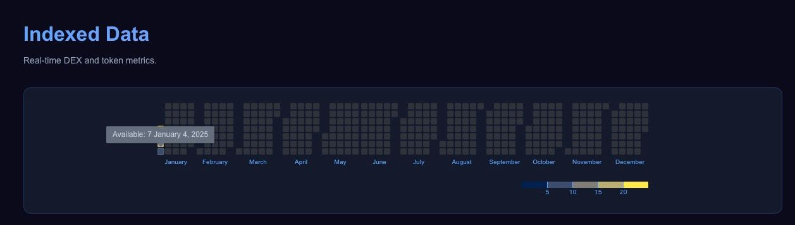

# Indexers and Transformers

## Introduction
AlphaArc’s indexing pipeline is the backbone of its data processing architecture, transforming raw blockchain data into structured, optimized datasets suitable for analytics and AI workflows. Built to handle Solana’s high transaction throughput and data volume, the pipeline ensures that even the most complex datasets are efficiently processed and readily accessible.

## Data Dashboard

AlphaArc’s [Web Data Dashboard](https://www.alphaarc.xyz/data) provides a real-time view of our data processing pipeline, allowing users to quickly access insights into the blockchain data we’ve processed. The dashboard highlights key metrics such as the number of blocks and transactions processed per hour, along with a detailed list of available 1-hour data chunks. Designed for speed and clarity, it ensures users can monitor data availability and processing activity at a glance.

We also provide minimal sample data as info tables for cross checks.

Different hour chunks can be navigated through the heatmap.

## Key Features
1) **High-Performance Architecture:**
    - Developed in Rust for maximum speed and reliability.
    - Handles Solana’s high throughput (~3,800 transactions per second) without bottlenecks.
2) **Modular Design:**
    - The pipeline consists of multiple modular components, each responsible for specific transformations.
    - New transformers can be added seamlessly, enabling adaptability to evolving data needs.
3) **Parquet Output:**
    - Outputs data in Apache Parquet format, ensuring compatibility with analytics tools and efficient storage.
4) **Interval-Based Processing:**
    - Data is chunked into configurable time intervals (e.g., 5-minute, 60-minute) to support both real-time and historical analysis.

## Pipeline 
1) **Data Ingestion:**
    - Solana blockchain data is streamed in real-time using RPC and WebSocket connections.
    - Redundant ingestion mechanisms ensure reliability and fault tolerance.
2) **Parsing and Transformation:**
    - Raw transaction data is parsed and transformed into a structured schema.
    - Includes processes like:
        - Filtering irrelevant transactions such as vote transactions.
        - Extracting fields such as priority fees and compute units.
        - Event parsing
        - Normalizing timestamps
3) **Enrichment:**
    - Adds derived fields, such as:
        - Token price at the time of transaction.
        - Wallet clustering based on historical activity (see A1 score).
        - Fee metrics aggregated by transaction type.
4) **Chunking and Aggregation:**
    - Data is grouped into time-based chunks (row groups) for efficient processing.
    - Aggregates metrics like total buy volume, unique wallets, or program invocations for each interval.
5) **Compression and Storage:**
    - Processed data is compressed using zstd and stored in Parquet files.
    - Stored datasets are indexed for fast retrieval by the query engine.

## Example Use Case

- **Token Activity Monitoring:**
    - Raw transaction data is ingested and transformed to highlight token-specific activity.
    - Aggregated metrics, such as buy/sell volume and unique wallets, are calculated for 5-minute intervals.
    - The resulting dataset is compressed and stored in a Parquet file, ready for querying by agents or dashboards.