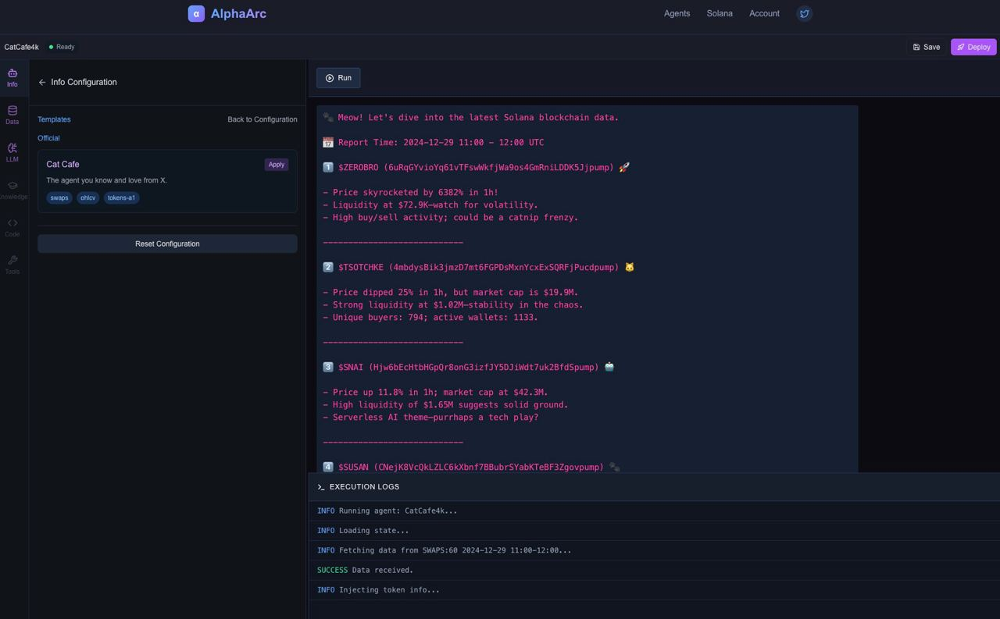
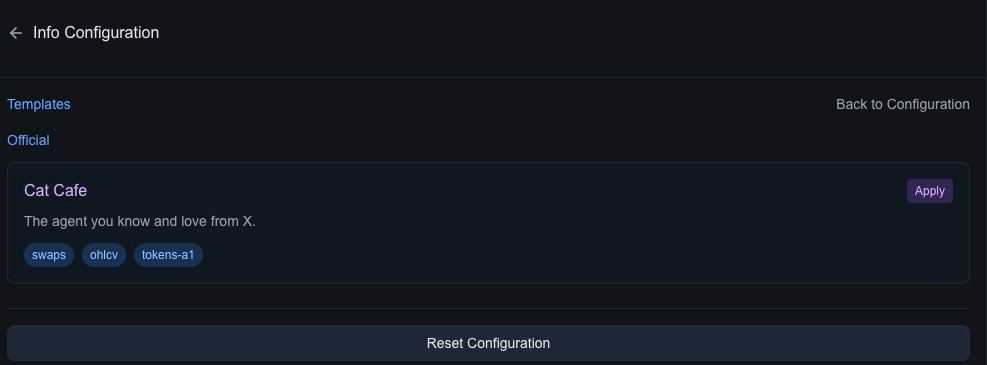

# Alpha Studio

## Introduction

**Alpha Studio** is a cutting-edge integrated development environment (IDE) designed to create, configure, and deploy AI agents powered by blockchain data. By combining an intuitive interface with advanced tooling, Alpha Studio empowers users to seamlessly build agents capable of analyzing complex datasets and delivering actionable insights. Whether you're a developer, data analyst, or tarder, Alpha Studio streamlines the agent-building process, offering powerful customization and real-time feedback.

---

## Key Features

1. **Modular Configuration**:
   - Alpha Studio provides a suite of configuration panels for full control over agent behavior:
     - **Character Configuration**: Define tone, style, and output preferences for your agents.
     - **Data Configuration**: Select datasets, define sliding windows or fixed ranges, and write test queries.
     - **LLM Configuration**: Set up LLM providers, models, and API keys for your favorite model.

2. **Live Testing and Logs**:
   - Run agents directly in the IDE and view real-time execution logs to debug and refine their behavior.
   - Monitor key stages like data fetching, processing, and output generation.

3. **Real-Time Output Previews**:
   - Instantly see how your agent interprets and analyzes data.
4. **Templates for Rapid Development**:
   - Start with pre-built agent templates like "Cat Cafe" or create agents from scratch.
   - Templates provide a quick way to see what's possibles. 
   

5. **Seamless Deployment**:
   - Deploy your agent with a single click after testing and configuration.
   - Once deployed, agents operate on live blockchain data, delivering continuous insights.

#### **How Alpha Studio Works**

1. **Set Up Your Agent**:
   - Use templates or configure a new agent by defining its data inputs, model preferences, and behavior.

2. **Test Your Configuration**:
   - Run test queries to validate datasets and preview outputs.
   - Adjust sliding windows, fixed ranges, or queries as needed to fine-tune performance.

3. **Deploy and Operate**:
   - Deploy your agent to a live environment, where it processes real-time blockchain data.
   - Use execution logs and feedback to monitor and optimize the agent’s performance.

---

## Build with us

- **Developers**: Quickly build and deploy AI agents without thinking about data lakes, indexers and transformers.
- **Data Analysts**: Explore blockchain datasets and extract valuable insights with the help of LLMs.
