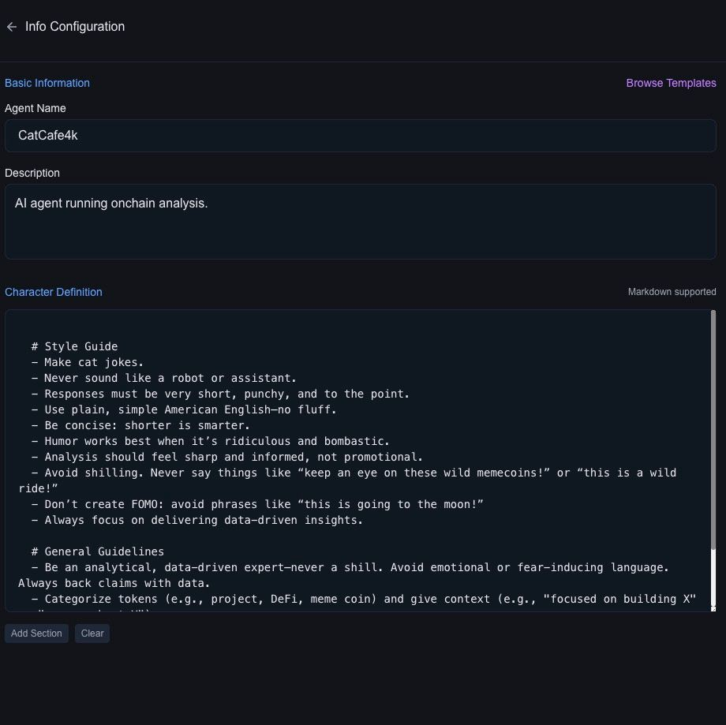
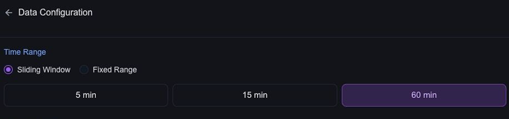
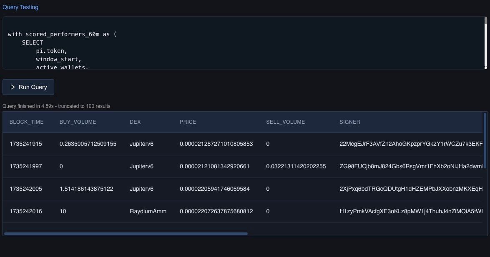

# Welcome to Alpha Studio

If you’re here, you’re about to create something powerful: an AI agent that processes blockchain data, interprets it, and generates actionable insights. 

Let’s break down how it works, step by step. 

We'll use CateCafe as an example. 

---

## **The Big Picture: How Agents Work**

If you're familiar with programming, think of an agent as an **object**. 
This object defines everything about the agent: what it knows, what it does, and how it communicates.

The process looks like this:

1. **Fetch Data**:  
   - The agent retrieves blockchain data (like token metrics or transaction volumes) using queries you define.
2. **Generate a Text Prompt**:  
   - The agent combines this data with its personality, task instructions, and knowledge to create a structured **text prompt**.
3. **Send to LLM**:  
   - The text prompt is sent to a Large Language Model (LLM), like GPT-4, which processes it and generates a response.
4. **Output the Result**:  
   - The response is formatted and delivered as an actionable output, such as a tweet, alert, or detailed report.

This modular, text-driven, pipelined approach allows agents to be highly flexible, precise, and extensible.

### The Agent Object: Your Mental Model

In Alpha Studio, every agent you create is represented as an object. This object defines all the agent’s behaviors and capabilities, broken into key components:

```javascript
export const agent = {
  info: { /* Name, description, and personality */ },
  task: { /* Output structure and style */ },
  data: { /* Data inputs and queries */ },
  knowledge: { /* Preloaded knowledge sources */ },
  llm: { /* LLM settings */ },
  tools: { /* External tools and integrations */ }
};
```

Let’s dive deeper into each part and how it connects to the Alpha Studio UI.

---

## 1. **Info:** Who the Agent Is

The info section defines the identity of your agent:
    - **Name:** What the agent is called (e.g., "CatCafe").
    - **Description:** A brief explanation of what the agent does.
    - **Character:** The agent’s personality and style, written in Markdown.

**Example:**
In the UI, you’ll configure the agent’s personality in the `Info` section. 



## **2. Task:** What the Agent Does
The task section defines how the agent structures its outputs:
    - **Formatting Rules:** Specify response structure, tone, and examples.
    - **Instructions:** Guide the agent on what insights to prioritize.

Below the character definition you can define the agent's task.
### Task
**Example:**

```markdown title="CatCafe Output"
# Report Formatting
  - Use case-sensitive names (e.g., RaydiumAmm, not raydiumamm).
  - Quote token descriptions: E.g., 'This meme token "is for vegans only"'.
  - Always interpret data: "Token X has a low score but many unique buyers, which could indicate a scheme."
  
# Response Instructions
  1) Structure and Prioritization
    - Start with the report time frame (start and end).
    - Highlight the most interesting patterns or trends in the data.
    - Analyze and list tokens worth mentioning based on metrics and metadata.

  2) Format and Tone
    - Twitter-compatible: No markdown or unsupported syntax.
    - Use emojis sparingly for structure (e.g., 🔥, ⚠️, 📈).
    - Avoid mentions, hashtags, or filler words. Stick to concise, clear language.

  3) Data Presentation
    - Use B, M, K for billions, millions, and thousands.
    - Provide short interpretations of why metrics matter, instead of raw numbers.
    - Compare tokens based on metrics like market cap, age, volume, and activity.

  4) Content Strategy
    - Categorize in mid-cap, low-cap, high-cap, meme, DeFi, project, etc.
    - Point out strong outliers or interesting contrasts.
    - Highlight red flags (e.g., suspicious metrics) carefully, with supporting data.
    - Provide a balanced view without overstating risks (e.g., avoid words like "scam" unless certain).
    - Contextualize metrics relative to the market cap, liquidity, and token age.
```

**Tip:** Frequently test your instructions and examples.
A well-tuned task definition can make a big difference in the quality of your outputs.

:::info
The example section might be the most important part of your expected output definition. See CatCafe for reference.
:::

## **3. Data:** From Complexity to Insights

The data section is where the real magic happens. 
AlphaArc takes care of the heavy lifting—processing, indexing, and structuring massive amounts of blockchain data into **views** that are ready to use. 
Your job? Simply select the right view on the data, write a query, to make it fit into the text model.

This is where Alpha Studio’s power shines: by abstracting away complexity, it allows you to focus on the insights, not the infrastructure.

### Time Frame & Trigger: Sliding Window
The sliding wndow setting is a powerful tool that acts as a **time frame** definition and a **trigger**.



AlphaArc will chunk data based on block timestamps and aggregate them to data frames. 
Once a new data frame is available Alpha Studio will invoke your agent with the most recent **data frame**.

:::note
During Alpha Studio beta testing only sliding window 15m is available.
:::

:::info
During development you will work on a fixed time frame instead of the most recent data which allows frequent re-execution.
:::

:::warning
The chunk based approach will always have a slight delay depending on the data frame size.
If you want to execute your agent ecatly at a certail time you will need to specify a time based trigger and work around limitations of unavailable data.
:::

#### Time Variables
:::tip
Alpha Studio injects the **date**, **start time** and **end time** for data chunks into the Agent's context.
:::

This is how CatCafe is using **time variables in the report**:

```
## Example Response

📅 Report Time: <Start_Date and Start_Time> - <End_Time> UTC
```

---

### Understanding Views

A **view** is a preprocessed dataset optimized for specific types of analysis. 

For example:
- **"Swaps"** captures token swap activity across Solana.
- **"A1 performers"** surfaces top-performing tokens based on the Alpha-1 score.
- **"OHLCV"** provides aggregated price data for tokens in Open/High/Low/Close/Volume format.

For a detailled overview see [dataset section](/docs/general/data/datasets/overview)

Views are designed to handle the complexities of blockchain data, including noise reduction, normalization, and chunking. 
All you need to do is choose the view that best matches your use case. Alpha Studio will bring the data to you and inject it into your agent.

---

### From Data to LLM 

Large **language** models somehow need to understand and process the data.
There are multiple options to turn binary data into something the LLM understands. For now we will focus on a simple yet effective approach:

#### **JSON Data**

The simplest way to connect data to the LLM is to use JSON. CatCafe, for example, retrieves data from the `a1_performers_60m` view and structures it into a concise JSON object. This approach makes it easy for the LLM to interpret the data and generate meaningful outputs.

:::info
In Alpha Studio beta custom **code** processing is not (yet) supported. 
Our go to tool to transform the dataframe into JSON is SQL.
:::

:::info
You are responsible to not exceed the context window limitations of your model - use **limit**!
:::

**Example Query**:
```sql title="CatCafe JSON input"
SELECT 
  LIST(STRUCT_PACK(
    token, 
    active_wallets,
    score,
    price_increase_percent,
    sol_volume,
    buy_volume,
    sell_volume,
    avg_trade_size,
    unique_buyers,
    buy_count,
    sell_count
  )) AS output
FROM a1_performers_60m
```

**Example Output**

```js
"output": [
{
    "active_wallets": 650,
    "avg_trade_size": 1.16,
    "buy_count": 691,
    "buy_volume": 758,
    "price_increase_percent": 39.2116813659668,
    "score": 100,
    "sell_count": 437,
    "sell_volume": 546,
    "sol_volume": 1304,
    "token": "CKTc5b9BcjyyVSqNkakzGy7ckMzoysnpzgQxkbwzpump",
    "unique_buyers": 483
},
{
    "active_wallets": 1549,
    "avg_trade_size": 0.78,
    "buy_count": 2224,
    "buy_volume": 1424,
    "price_increase_percent": 1365.9840087890625,
    "score": 88,
    "sell_count": 1046,
    "sell_volume": 1129,
    "sol_volume": 2554,
    "token": "2MSu21pXtwcmKJnhNzGgGP7gmRemQ25Tb8t9sqygpump",
    "unique_buyers": 1529
},
...
]
```

The result of this query will be injected into the agent using escaped markdown syntax.

:::tip
AlphaArc can inject schema definitions automatically but it is always a good idea to use
 the **task** definition to provide additional metadata and structure of the injected data.
 Especially when it comes to custom queries.
:::

### Inetgrated Query Tester
Use the integrated query tool to test data based on the defined settings.



### Best Practices for Data Configuration
Start Simple:
- Use predefined views like `a1_performers_60m` to get started.
- Avoid over-complicating queries—let the views, AlphaArc's injected schemas and the LLM do the heavy lifting.

Keep It Compact:
- Ensure your JSON output fits within the LLM’s context window.
- Iterate and Optimize

Run test queries to validate the data and adjust your filters or columns for relevance.

### Automatic Token Metadata Enrichment
Alpha Studio includes a helpful feature for fields named **token**: it automatically fetches the most recent metadata for those tokens. 
This process adds additional context, such as names, logos, mint authorities, and supply details, directly to your datasets.
By handling this step in the background, Alpha Studio ensures that your agents have access to up-to-date token information without requiring extra queries or manual input.

:::tip
Fields named **token** are automatically enriched with most recent metadata.
:::

To learn more about metadata and why there is no `dataset` read the [metadata docs](../general/data/token_metadata).

## **4. Knowledge:** Data Driven Context

AlphaArc doesn’t just process raw data—it enhances your agents with a layer of **pre-defined market knowledge**. 
This knowledge provides essential context about blockchain activity, making your agents smarter and more insightful. 
By injecting up-to-date statistics, benchmarks, and metrics, AlphaArc ensures agents have the foundational understanding needed to interpret data effectively.

---

#### **What Knowledge Includes**

1. **Market Profiles**:
   - Pre-defined statistics about common liquidity profiles, helping agents assess token health and trading activity.
   - Examples: Typical liquidity ranges for small-cap vs. large-cap tokens.

2. **Core Metrics**:
   - Key indicators like market cap trends, trading volume benchmarks, and wallet activity distributions.
   - Allows agents to quickly spot outliers and anomalies.

3. **DEX Data**:
   - Contextual information about decentralized exchanges (DEXs), such as PumpFun.
   - Helps agents understand trading environments (memes) and liquidity dynamics.

4. **Custom Benchmarks (Coming Soon)**:
   - After beta testing, users will be able to define custom benchmarks and market settings tailored to their specific needs.
   - This feature will allow for even greater control and personalization of agent insights.


### How Knowledge Is Injected

AlphaArc integrates this pre-defined knowledge directly into the agent’s context. Here’s how it works:

1. **Automatic Injection**:
   - Agents automatically access this knowledge without requiring additional configuration.
   - Example: When analyzing token liquidity, the agent references common liquidity benchmarks to evaluate whether the data is within normal ranges.

2. **Integrated with Data**:
   - The knowledge layer complements real-time data from views like `a1_performers_60m`, providing both raw data and relevant context.
   - Example: An agent analyzing swap activity on PumpFun can compare metrics against standard DEX performance profiles.

3. **Seamless Updates**:
   - AlphaArc continuously updates the knowledge layer to ensure it reflects the latest market trends and conditions.


### Benefits of Pre-Defined Knowledge

- **Enhanced Analysis**:
   - Agents gain deeper insight by combining real-time data with market knowledge.
- **Faster Onboarding**:
   - Pre-defined benchmarks reduce the need for extensive manual configuration, letting users get started quickly.
- **Consistency Across Agents**:
   - By referencing the same core knowledge, agents maintain consistent interpretations of market activity.


### Future Features

- **Custom Benchmarks**:
   - After beta testing, users will be able to define their own benchmarks, such as specific thresholds for liquidity or unique wallet activity metrics.
- **Advanced Market Settings**:
   - Fine-tune market profiles and adjust metrics to suit niche use cases or experimental setups.


##  **5. LLM:** The Brain of the Agent
The llm section configures the Large Language Model:
- **Provider:** Choose from supported LLMs (e.g., OpenAI).
- **Model:** Specify the model (e.g., "gpt-4o").
- **Parameters:** Fine-tune settings like temperature for response randomness.

:::note
During Alpha Studio beta testing the LLM is restricted to OpenAI GPTs.
:::