# Connecting an Agent to Twitter/X

The authentication flow to connect an agent to a Twitter/X account follows the recommended process outlined in the Twitter/X Developer Docs, ensuring compliance with their automation policies.

> Automated accounts are created and managed by other people on Twitter.  
> Our Automation rules require these accounts to display labels and remain connected to a human-run account.  
> When someone who manages an automated account sets that account to display the identifying automatic account label, it also connects their human-run account to let everyone know who’s managing it.  
>  
> Source: [Twitter/X Automated Account Labels](https://help.x.com/en/using-x/automated-account-labels)

Automated accounts will display an `Automated` label on posts and show the operator above the bio.

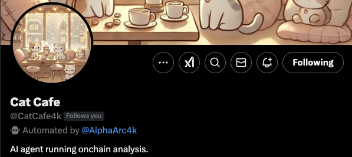

---

## Requirements

You will need two X accounts:
- **Operator account** (app developer and owner)
- **Bot/Agent account**

---

## 1. Configure the X App

To automate the agent, you'll need to create an X app. Log in to the [Twitter/X Developer Portal](https://developer.twitter.com/) using the **operator account** and create a new app.

### 1.1 Name the App

Provide a name for your app.

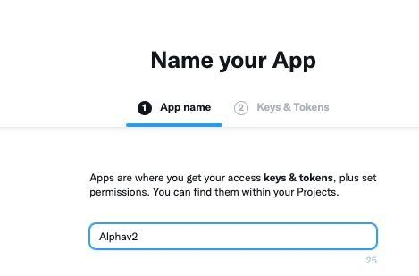

### 1.2 Copy App Credentials

After creating the app, copy its credentials for later use.

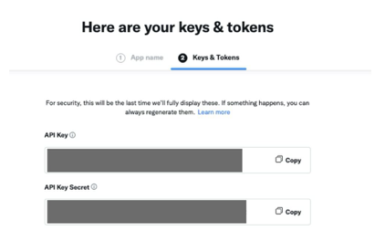

---

## 2. Link the Agent to the X App

Using the app credentials, configure the agent.

### 2.1 Enable X Integration in Alpha Studio

Log in to **Alpha Studio**, navigate to the `Actions` section, and select the X integration.  
Press the `Connect X Account` button.

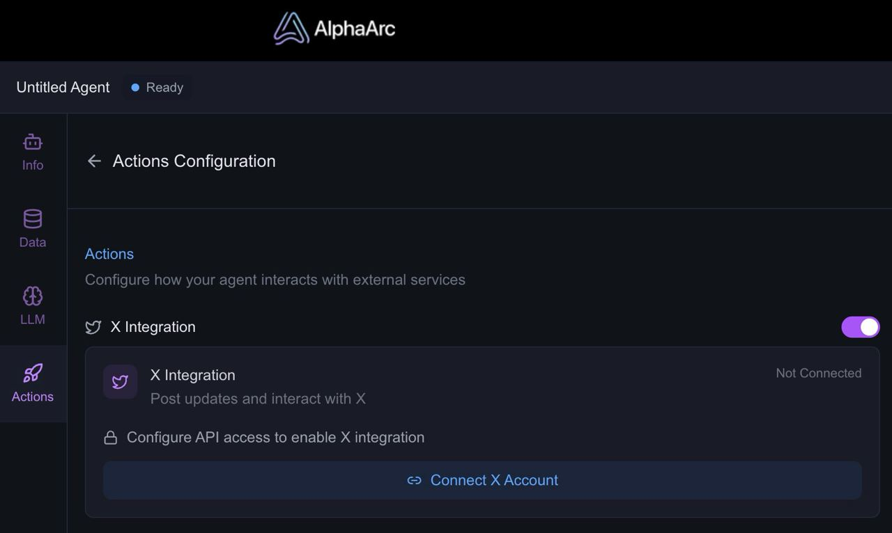

### 2.2 Store App Credentials

In the configuration panel, insert the app credentials.

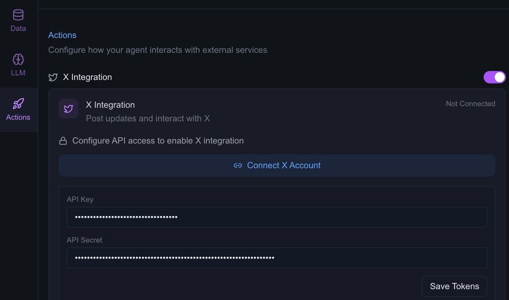

### 2.3 Save App Credentials

Changes are not auto-saved, so press the `Save Tokens` button to store the app credentials before proceeding.

At this point, the X app is set up, and Alpha Studio has access to it. The app can now perform actions on behalf of users, bots, or agents. Next, you need to grant the app access to the bot/agent account.

---

## 3. Granting Account Rights to the App

The auth flow uses OAuth, as detailed in the [Twitter/X OAuth Docs](https://docs.x.com/resources/fundamentals/authentication/oauth-1-0a/obtaining-user-access-tokens).

### 3.1 Generate an Auth Callback URL

In Alpha Studio, press the `refresh` icon next to the callback link field to generate a callback URL.

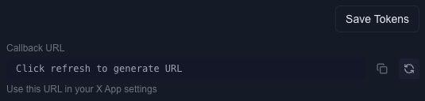

### 3.2 Set the Callback in the X App

Copy the generated callback URL and go back to the X app settings in the Developer Portal.  
Open the `User Authentication Settings` section.

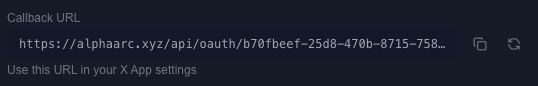

### 3.3 Configure User Authentication

In the `User Authentication Settings` section:
- Request **read** and **write** access for the app.
- Paste the generated callback URL.

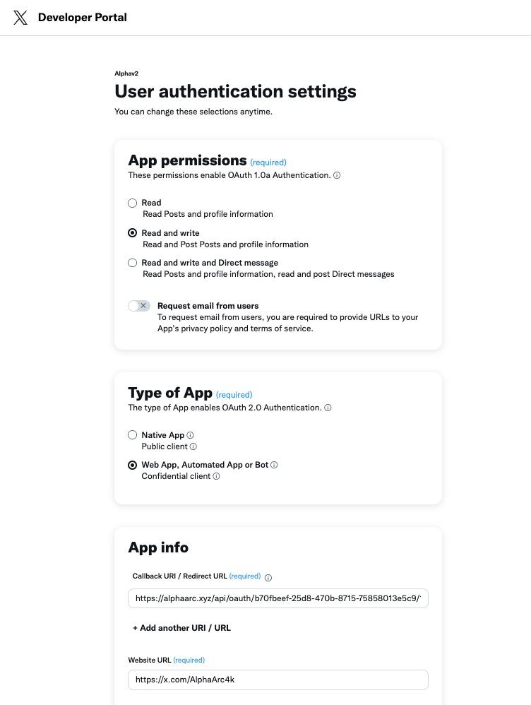

Save the changes and return to Alpha Studio.

### 3.4 Generate an Auth Link

In Alpha Studio, press the refresh button to generate an `Auth URL`.

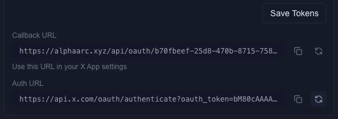

Copy the link and open it in a browser where the bot/agent account is logged in with an active session.  
This will open an authentication prompt.

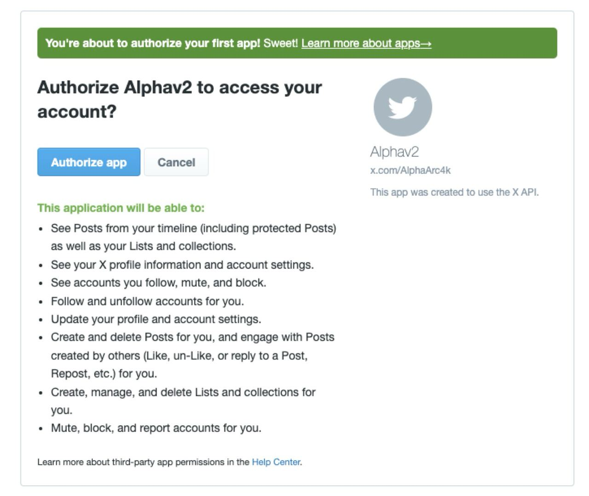

Authorize the app to give it full account access. After authorization, you will be redirected to Alpha Studio.

### 3.5 Confirm Connection

Congratulations! The agent, X app, and accounts are now linked. You should see the connected state reflected in the configuration panel.

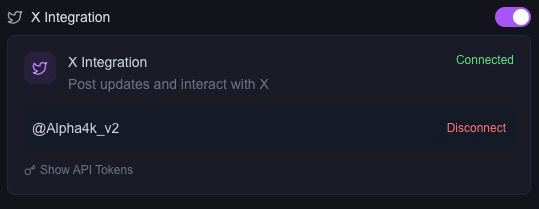

If an Alpha Studio window is still open from before, close or reload it to avoid overwriting configuration changes.

---

## 4. Set the Agent as an Automated Account

In the bot/agent account's profile settings, enable the automated account label:

`More` > `Settings and Privacy` > `Your Account` > `Account Information` > `Automation`

---

## 5. Important Notes

- While the X integration is **enabled** and the agent is **deployed**, it will tweet the output.  
  - Ensure the agent has a **Pro** account or configure it to cap output to the maximum post length.
- To disable the X integration, toggle the switch and press `Save`.
- Keep all generated links, keys etc private and don't share screenshots publicly (treat them as credentials)

---
